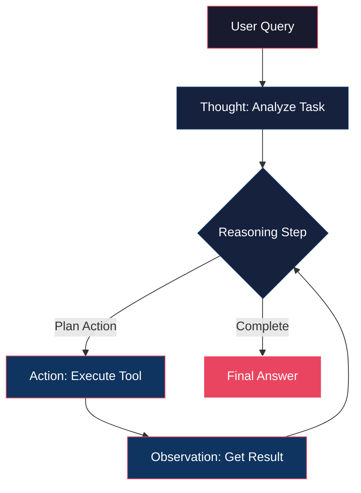
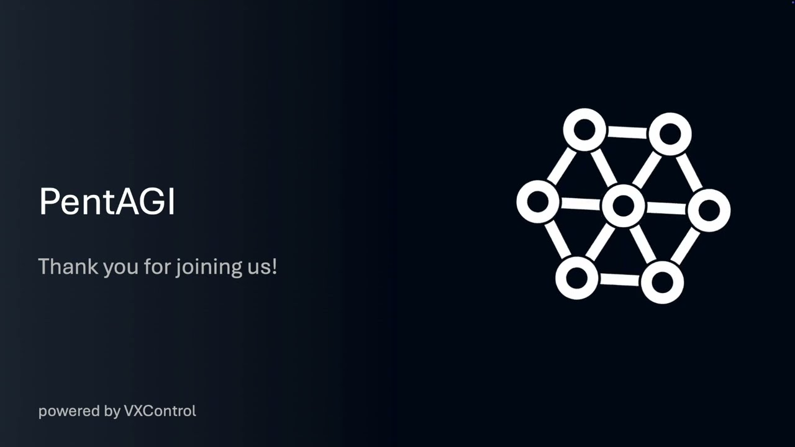
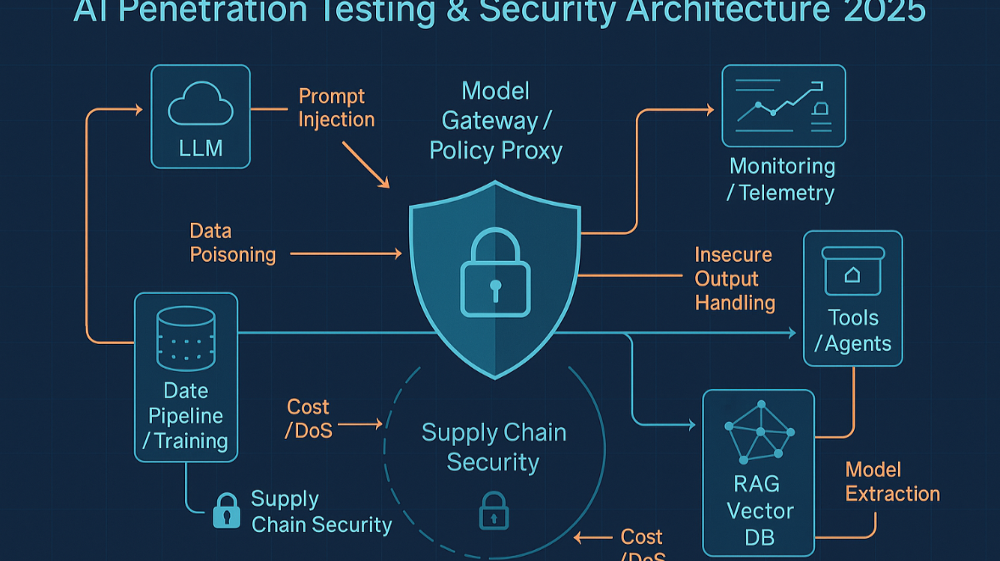

<p align="center">
  
</p>

---

<div align="center">

[](LICENSE)
[](https://github.com/yourusername/Awesome-Hacking-with-AI/pulls)
[](https://github.com/sindresorhus/awesome)
[](https://github.com/yourusername/Awesome-Hacking-with-AI/stargazers)
[](https://github.com/yourusername/Awesome-Hacking-with-AI/commits/main)

</div>

---

# Awesome-Hacking-with-AI

## The Definitive Guide to AI-Powered Offensive Security

<p align="center">
  
</p>

---

## 📌 Table of Contents

- [Introduction](#introduction)
- [Quick Start: Your First AI-Powered Pentest](#quick-start-your-first-ai-powered-pentest)
- [Why AI in Hacking?](#why-ai-in-hacking)
- [Learning Roadmap: Mastering AI Hacking](#learning-roadmap-mastering-ai-hacking)
- [Core Concepts: AI Agent Architectures](#core-concepts-ai-agent-architectures)
  - [The ReAct Pattern: Reasoning and Acting](#the-react-pattern-reasoning-and-acting)
- [Categories of AI Hacking Tools](#categories-of-ai-hacking-tools)
  - [Autonomous AI Agents](#autonomous-ai-agents)
  - [AI-Powered CLI \& Console Tools](#ai-powered-cli--console-tools)
- [Prompt Library](#prompt-library)
  - [Payload Generation](#-payload-generation)
  - [Code Analysis \& Vulnerability Identification](#-code-analysis--vulnerability-identification)
  - [OSINT Target Profiling](#-osint-target-profiling)
  - [Exploit Generation](#-exploit-generation)
  - [Multi-Turn Vulnerability Discovery](#-multi-turn-vulnerability-discovery)
- [Featured Tools \& Case Studies](#featured-tools--case-studies)
  - [PentAGI: Penetration Testing Artificial General Intelligence](#pentagi-penetration-testing-artificial-general-intelligence)
  - [xOffense: Multi-Agent Offensive Framework](#xoffense-multi-agent-offensive-framework)
  - [Penligent: Agentic AI Hacker](#penligent-agentic-ai-hacker)
  - [Shannon: Autonomous Web Application Exploitation](#shannon-autonomous-web-application-exploitation)
- [AI Hacking Resources \& Links](#ai-hacking-resources--links)
- [Advanced Prompt Engineering](#advanced-prompt-engineering)
- [Ethical Considerations \& Responsible Disclosure](#ethical-considerations--responsible-disclosure)
- [Contributing](#contributing)
- [License](#license)
- [References](#references)

---

## Introduction

The convergence of Artificial Intelligence (AI) and cybersecurity has ushered in a new era for offensive security. AI is no longer merely a defensive asset; it is rapidly becoming a formidable force in penetration testing, vulnerability discovery, and red teaming operations.

This repository serves as the definitive **"Bible"** for AI-powered offensive security, providing a comprehensive guide for security professionals, researchers, and enthusiasts. We delve into the technical underpinnings, operational workflows, and practical applications of AI in offensive contexts, emphasizing **ethical usage and responsible disclosure**.

> ⚠️ **Disclaimer**: All tools and techniques presented in this repository are intended for **ethical hacking, authorized penetration testing, and academic security research only**. Unauthorized access to computer systems is illegal and strictly prohibited.

---

## 🚀 Quick Start: Your First AI-Powered Pentest

Get up and running with AI-powered penetration testing in 3 simple steps:

### Step 1: Install Guardian-CLI

```bash
# Clone the repository
git clone https://github.com/yourusername/guardian-cli.git
cd guardian-cli

# Install dependencies
pip install -r requirements.txt

# Configure your API key
export OPENAI_API_KEY="sk-your-key-here"
```

### Step 2: Create Your Configuration

Create a `guardian.yaml` file:

```yaml
ai:
  provider: openai
  openai:
    model: gpt-4o
    api_key: sk-your-key-here
tools:
  nmap:
    enabled: true
    args: "-sV -p-"
  nuclei:
    enabled: true
    templates: "cves,vulnerabilities"
```

### Step 3: Run Your First Scan

```bash
# Execute autonomous pentest
guardian scan --target example.com --workflow autonomous

# Or use interactive mode
guardian scan --target example.com --workflow interactive
```

> **Pro-Tip**: Start with `--workflow interactive` to understand how the AI agent thinks before switching to autonomous mode for production assessments.

---

## Why AI in Hacking?

AI's integration into offensive security paradigms offers transformative advantages:

| Advantage | Description |
|:---------|:------------|
| **Hyper-Automation** | AI agents automate entire attack chains, from reconnaissance to exploitation |
| **Speed & Efficiency** | ML algorithms process vast datasets to identify subtle attack vectors |
| **Adaptive Strategies** | AI learns from interactions to bypass defenses and exploit zero-days |
| **Scalability** | Parallel execution across numerous targets and environments |
| **Sophisticated Decision-Making** | Advanced models reason through complex scenarios |

---

## Learning Roadmap: Mastering AI Hacking

A structured path to become proficient in AI-powered offensive security:

| Phase | Focus Area | Key Topics |
|:------|:-----------|:-----------|
| **1** | **Foundations** | Transformer architectures, LLM fundamentals, Attention mechanisms, Vector databases |
| **2** | **AI Security** | OWASP LLM Top 10, Prompt Injection, Jailbreaking, Training Data Poisoning |
| **3** | **Offensive AI** | ReAct pattern, LangChain/LangGraph for security, Autonomous OSINT agents |
| **4** | **Advanced Ops** | Evasive payload generation, AI-driven C2 infrastructures, Automated exploit development |
| **5** | **Defense** | ML-based anomaly detection, AI-assisted log analysis, Automated incident response |

---

## Core Concepts: AI Agent Architectures

### The ReAct Pattern: Reasoning and Acting

The **ReAct (Reasoning + Acting)** pattern is a prominent architectural design for AI agents in offensive security. It allows AI agents to interleave reasoning with acting in an iterative loop.



**Key Components:**

| Component | Description |
|:----------|:------------|
| **Thought** | Internal monologue - reasons about current state, identifies goals, plans actions |
| **Action** | Tool/command execution based on reasoning |
| **Observation** | Output/result from action execution |

The loop (`Thought → Action → Observation`) continues until the objective is achieved.

---

## Categories of AI Hacking Tools

### Autonomous AI Agents

Sophisticated AI systems capable of executing complex hacking workflows with minimal human intervention.

| Tool | Description | Key Features | Link |
|:-----|:------------|:------------|:-----|
| **PentAGI** | Fully autonomous pentesting AI agent with 20+ integrated tools | Docker sandbox, smart memory, knowledge graph, detailed reporting | [GitHub](https://github.com/pentagi/pentagi) |
| **xOffense** | Multi-agent penetration testing framework with offensive knowledge-enhanced LLMs | Specialized agents for recon, scanning, exploitation, orchestration layer | [arXiv](https://arxiv.org/abs/2509.13021) |
| **Penligent** | World's first agentic AI hacker - simplifies complex security assessments | Natural language prompts, autonomous red teaming | [Website](https://penligent.ai/) |
| **Shannon** | Autonomous AI hacker delivering actual exploits for web applications | Payload generation, attack surface analysis, custom exploits | [GitHub](https://github.com/KeygraphHQ/shannon) |

---

### AI-Powered CLI & Console Tools

Intelligent automation directly in your terminal:

| Tool | Description | Usage |
|:-----|:------------|:------|
| **Guardian-CLI** | Production-ready AI pentesting automation using Gemini + LangChain | `guardian scan --target example.com --workflow autonomous` |
| **Zen-AI-Pentest** | Open-source framework using autonomous agents + security utilities | Automated scanning and exploitation |
| **PentestGPT** | ChatGPT-powered interactive guidance for pentesting tasks | Interactive assistance |

#### Guardian-CLI Configuration Example

```yaml
ai:
  provider: openai
  openai:
    model: gpt-4o
    api_key: sk-your-key-here
tools:
  nmap:
    enabled: true
    args: "-sV -p-"
  nuclei:
    enabled: true
    templates: "cves,vulnerabilities"
```

---

## Prompt Library

Advanced prompts for offensive security operations:

### 🔴 Payload Generation

```markdown
"""
You are an expert penetration tester. Generate a polymorphic Cross-Site Scripting (XSS) payload that can bypass common WAFs and CSP. The payload should execute alert(document.domain).

Target Context: User input reflected in an HTML attribute within a <div> tag.

Provide three distinct polymorphic variants using:
- HTML entity encoding
- JavaScript character escaping
- Event handler variations
"""
```

> **💡 Pro-Tip**: Using "polymorphic" signals to the LLM that you want VARIABLE code structure, not just obfuscation. This increases the chance of bypassing signature-based WAFs that only detect known patterns.

---

### 🔴 Code Analysis & Vulnerability Identification

```python
"""
You are a senior security auditor specializing in Python web applications. Analyze this Flask code for:
- SQL Injection
- XSS
- Command Injection
- Insecure Deserialization
- Hardcoded credentials

For each vulnerability found:
1. Explain the flaw
2. Provide exploitation vector
3. Suggest remediation

Code to analyze:
```python
from flask import Flask, request, jsonify
import sqlite3

app = Flask(__name__)

@app.route('/users')
def get_user():
    user_id = request.args.get('id')
    conn = sqlite3.connect('database.db')
    cursor = conn.cursor()
    query = f"SELECT * FROM users WHERE id = {user_id}"
    cursor.execute(query)
    user = cursor.fetchone()
    conn.close()
    return jsonify(user)
```
"""
```

> **💡 Pro-Tip**: By asking for "exploitation vector" specifically, you force the LLM to think like an attacker, making its analysis more practical for pentesters.

---

### 🔴 OSINT Target Profiling

```markdown
"""
You are an OSINT specialist AI agent. Gather public information about:
1. Professional social media profiles (LinkedIn, GitHub)
2. Public mentions, publications, presentations
3. Associated email addresses or contact info
4. Personal interests for social engineering

Target: Jane Doe, TechCorp Inc.
Provide summary with direct source links.
"""
```

> **💡 Pro-Tip**: Asking for "direct source links" ensures verifiability and helps build credible intelligence reports for clients.

---

### 🔴 Exploit Generation

```python
"""
You are an exploit development AI. Given this vulnerability:

CVE-2025-XXXX: RCE in 'File Upload' functionality due to improper validation

Generate a Python PoC exploit that:
1. Uploads malicious PHP web shell: <?php system($_GET['cmd']); ?>
2. Verifies upload and accesses web shell
3. Executes 'whoami' via web shell

Target: http://example.com/upload
Parameter: file
"""
```

> **💡 Pro-Tip**: Always include verification steps (step 2) in exploit prompts to ensure the PoC is actionable, not theoretical.

---

### 🔴 Multi-Turn Vulnerability Discovery

**Turn 1 - Reconnaissance:**
```markdown
"""
Autonomous reconnaissance agent. Identify all publicly exposed web assets 
(domains, subdomains, IPs, open ports) for 'ExampleCorp'.

Use passive OSINT only. Prioritize speed and breadth.
Tools: subdomain_enum_tool, port_scan_tool_passive, whois_lookup
"""
```

> **💡 Pro-Tip**: Specifying "passive OSINT only" prevents the AI from attempting active scans that could trigger alerts or cause legal issues.

**Turn 2 - Vulnerability Scanning:**
```markdown
"""
Based on recon findings, transition to vulnerability scanning.
Focus on OWASP Top 10 on discovered web assets.
Prioritize critical/high severity.

Tools: web_vulnerability_scanner_ai, cve_lookup_tool
"""
```

> **💡 Pro-Tip**: Asking for "prioritization" forces the LLM to think strategically about risk assessment, mirroring real-world pentest workflows.

**Turn 3 - Exploitation Planning:**
```markdown
"""
Given identified critical vulnerabilities, formulate conceptual 
exploitation plan for highest-severity finding.
Describe attacker steps, tools, expected outcome.
NO actual exploitation - theoretical proof-of-concept only.

Tools: exploit_db_search, metasploit_module_finder
"""
```

> **💡 Pro-Tip**: Adding "NO actual exploitation" is critical for legal protection and ensures the output stays within educational boundaries.

---

## Featured Tools & Case Studies

### PentAGI: Penetration Testing Artificial General Intelligence

<p align="center">
  
</p>

PentAGI is an innovative, fully autonomous AI agent system for comprehensive security testing. It orchestrates multiple AI agents and integrates **20+ professional security tools** (Nmap, Metasploit, SQLMap) within a sandboxed Docker environment.

**Key Features:**
- 🤖 **Fully Autonomous** - Self-directed penetration testing
- 🐳 **Sandboxed Environment** - Isolated Docker containers
- 🔧 **Integrated Toolset** - Industry-standard security tools
- 🧠 **Smart Memory & Knowledge Graph** - Persistent learning (Graphiti + Neo4j)
- 📊 **Comprehensive Reporting** - Detailed vulnerability reports with exploitation guides
- 📈 **Real-time Monitoring** - Grafana/Prometheus integration

---

### xOffense: Multi-Agent Offensive Framework

<p align="center">
  
</p>

xOffense automates security assessment using **offensive knowledge-enhanced LLMs** and multi-agent systems.

**Key Features:**
- 🎯 **Multi-Agent Architecture** - Specialized agents for each phase
- 🧠 **LLM-Enhanced** - Leverages offensive knowledge for decision-making
- ⚡ **Automated Workflow** - Streamlined security assessment
- 🔄 **Adaptive Execution** - Dynamic attack strategy adjustment

---

### Penligent: Agentic AI Hacker

The world's first **agentic AI hacker** - democratizes advanced penetration testing.

**Key Features:**
- 🎤 **Natural Language Interface** - Initiate tests with simple prompts
- 🛡️ **Autonomous Red Teaming** - Self-directed scenario execution
- 📋 **Evidence-Driven Reporting** - Actionable insights with PoC
- 👥 **Accessible** - No deep pentesting expertise required

---

### Shannon: Autonomous Web Application Exploitation

Shannon delivers **actual exploits**, not just alerts - proactively breaking web apps before attackers.

**Key Features:**
- 💥 **Autonomous Exploit Development** - Generates functional exploits
- 🌐 **Web-Focused** - Specialized in web app pentesting
- 🎯 **Payload Generation** - Intelligent diverse attack payloads
- 🔍 **Attack Surface Analysis** - Thorough entry point examination
- 📝 **Professional Reporting** - Detailed findings and exploitation guides

---

## AI Hacking Resources & Links

| Category | Resource | Description |
|:---------|:---------|:------------|
| **Framework** | [LangChain](https://github.com/langchain-ai/langchain) | Building LLM applications through composability |
| **Security** | [OWASP LLM Top 10](https://owasp.org/www-project-top-10-for-large-language-model-applications/) | Standard LLM security risks awareness |
| **Research** | [arXiv Offensive AI](https://arxiv.org/search/?query=offensive+ai&searchtype=all) | Academic papers on offensive AI |
| **Models** | [Hugging Face Security](https://huggingface.co/models?search=security) | Security-specialized models |
| **Training** | [Promptfoo](https://github.com/promptfoo/promptfoo) | LLM prompt testing and red-teaming |
| **Tools** | [Autonomous Hacking Flow](assets/images/autonomous_hacking_flow.png) | AI pentesting workflow diagram |

---

## Advanced Prompt Engineering

Master the art of crafting prompts that yield precise, actionable results:

| Principle | Description |
|:----------|:------------|
| **Role-Playing** | Assign specific persona (e.g., "expert penetration tester") |
| **Clear Objectives** | Define exact goal, output format, constraints |
| **Contextual Information** | Provide background data, code snippets, vulnerability reports |
| **Step-by-Step Instructions** | Break complex tasks into logical sequences |
| **Ethical Guardrails** | Explicitly state legal compliance requirements |
| **Tool Integration** | Define available tools and usage rules |

---

## Ethical Considerations & Responsible Disclosure

⚠️ **IMPORTANT**: This repository is strictly intended for:
- ✅ Ethical hacking
- ✅ Authorized penetration testing
- ✅ Academic security research

**Any misuse for illegal activities is unequivocally condemned.**

Users must have **explicit, written authorization** before conducting security assessments. Adherence to local, national, and international laws is paramount.

---

## Contributing

We welcome contributions! Please refer to `CONTRIBUTING.md` for guidelines on:
- Adding new tools
- Updating descriptions
- Suggesting new categories
- Improving code examples

---

## License

This project is licensed under the **MIT License** - see the [LICENSE](LICENSE) file for details.

---

## References

| # | Citation |
|:--|:---------|
| [1] | Ostorlab. (2026). *8 Open-Source AI Pentest Tools for Security Teams in 2026*. https://blog.ostorlab.co/8-open-source-ai-pentest-tools-2026.html |
| [2] | Luong, P. D. (2025). *xOffense: An AI-driven autonomous penetration testing framework*. arXiv:2509.13021. https://arxiv.org/abs/2509.13021 |
| [3] | Penligent. (n.d.). *The World's First Agentic AI Hacker*. https://penligent.ai/ |
| [4] | KeygraphHQ. (n.d.). *shannon: Fully autonomous AI hacker*. https://github.com/KeygraphHQ/shannon |
| [5] | OTR. (2025). *Building An Offensive Security AI AI Agent — Part 1*. InfoSec Write-ups. https://infosecwriteups.com/building-my-first-offensive-security-agent-part-1-7b2dbb93c842 |

---

<p align="center">
  <strong>⭐ Star this repository if you find it useful!</strong>
</p>
