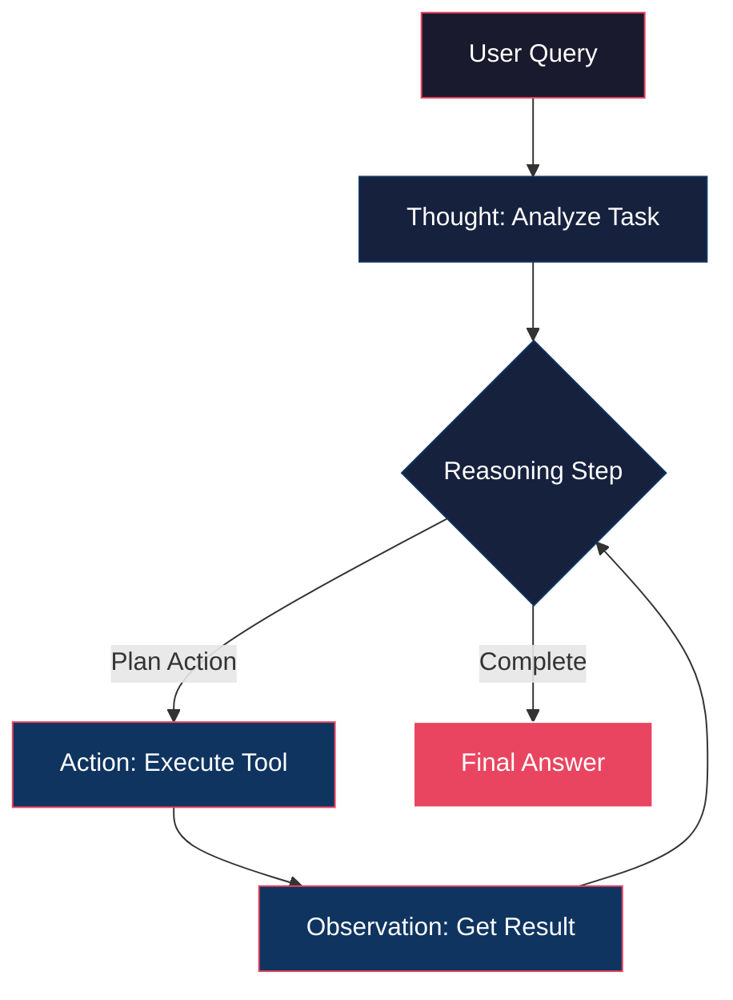

<p align="center">
  
</p>

---

<div align="center">

[](LICENSE)
[](https://github.com/yourusername/Awesome-Hacking-with-AI/pulls)
[](https://github.com/sindresorhus/awesome)
[](https://github.com/yourusername/Awesome-Hacking-with-AI/stargazers)
[](https://github.com/yourusername/Awesome-Hacking-with-AI/commits/main)

</div>

---

# Awesome-Hacking-with-AI

## The Definitive Guide to AI-Powered Offensive Security

---

## 📌 Table of Contents

- [Introduction](#introduction)
- [Quick Start: Your First AI-Powered Pentest](#quick-start-your-first-ai-powered-pentest)
- [Why AI in Hacking?](#why-ai-in-hacking)
- [Learning Roadmap: Mastering AI Hacking](#learning-roadmap-mastering-ai-hacking)
- [Core Concepts: AI Agent Architectures](#core-concepts-ai-agent-architectures)
  - [The ReAct Pattern: Reasoning and Acting](#the-react-pattern-reasoning-and-acting)
- [Categories of AI Hacking Tools](#categories-of-ai-hacking-tools)
  - [Autonomous AI Agents](#autonomous-ai-agents)
  - [AI-Powered CLI \& Console Tools](#ai-powered-cli--console-tools)
- [Prompt Library](#prompt-library)
  - [Payload Generation](#-payload-generation)
  - [Code Analysis \& Vulnerability Identification](#-code-analysis--vulnerability-identification)
  - [OSINT Target Profiling](#-osint-target-profiling)
  - [Exploit Generation](#-exploit-generation)
  - [Multi-Turn Vulnerability Discovery](#-multi-turn-vulnerability-discovery)
- [Featured Tools \& Case Studies](#featured-tools--case-studies)
  - [PentAGI: Penetration Testing Artificial General Intelligence](#pentagi-penetration-testing-artificial-general-intelligence)
  - [xOffense: Multi-Agent Offensive Framework](#xoffense-multi-agent-offensive-framework)
  - [Penligent: Agentic AI Hacker](#penligent-agentic-ai-hacker)
  - [Shannon: Autonomous Web Application Exploitation](#shannon-autonomous-web-application-exploitation)
- [Advanced AI-Powered Offensive Tactics](#advanced-ai-powered-offensive-tactics)
  - [AI in Social Engineering and Personalized Phishing](#ai-in-social-engineering-and-personalized-phishing)
  - [AI-Powered Malware Development](#ai-powered-malware-development)
  - [AI-Driven Botnets and C2](#ai-driven-botnets-and-c2)
  - [AI in Network Analysis and Exploitation](#ai-in-network-analysis-and-exploitation)
  - [Featured AI Hacking Tools](#featured-ai-hacking-tools)
- [Advanced Prompt Engineering](#advanced-prompt-engineering)
- [Ethical Considerations \& Responsible Disclosure](#ethical-considerations--responsible-disclosure)
- [Contributing](#contributing)
- [License](#license)
- [References](#references)

---

## Introduction

The convergence of Artificial Intelligence (AI) and cybersecurity has ushered in a new era for offensive security. AI is no longer merely a defensive asset; it is rapidly becoming a formidable force in penetration testing, vulnerability discovery, and red teaming operations.

This repository serves as the definitive **"Bible"** for AI-powered offensive security, providing a comprehensive guide for security professionals, researchers, and enthusiasts. We delve into the technical underpinnings, operational workflows, and practical applications of AI in offensive contexts, emphasizing **ethical usage and responsible disclosure**.

> ⚠️ **Disclaimer**: All tools and techniques presented in this repository are intended for **ethical hacking, authorized penetration testing, and academic security research only**. Unauthorized access to computer systems is illegal and strictly prohibited.

---

## 🚀 Quick Start: Your First AI-Powered Pentest

Get up and running with AI-powered penetration testing in 3 simple steps:

### Step 1: Install Guardian-CLI

```bash
# Clone the repository
git clone https://github.com/yourusername/guardian-cli.git
cd guardian-cli

# Install dependencies
pip install -r requirements.txt

# Configure your API key
export OPENAI_API_KEY="sk-your-key-here"
```

### Step 2: Create Your Configuration

Create a `guardian.yaml` file:

```yaml
ai:
  provider: openai
  openai:
    model: gpt-4o
    api_key: sk-your-key-here
tools:
  nmap:
    enabled: true
    args: "-sV -p-"
  nuclei:
    enabled: true
    templates: "cves,vulnerabilities"
```

### Step 3: Run Your First Scan

```bash
# Execute autonomous pentest
guardian scan --target example.com --workflow autonomous

# Or use interactive mode
guardian scan --target example.com --workflow interactive
```

> **Pro-Tip**: Start with `--workflow interactive` to understand how the AI agent thinks before switching to autonomous mode for production assessments.

---

## Why AI in Hacking?

AI's integration into offensive security paradigms offers transformative advantages:

| Advantage | Description |
|:---------|:------------|
| **Hyper-Automation** | AI agents automate entire attack chains, from reconnaissance to exploitation |
| **Speed & Efficiency** | ML algorithms process vast datasets to identify subtle attack vectors |
| **Adaptive Strategies** | AI learns from interactions to bypass defenses and exploit zero-days |
| **Scalability** | Parallel execution across numerous targets and environments |
| **Sophisticated Decision-Making** | Advanced models reason through complex scenarios |

---

## Learning Roadmap: Mastering AI Hacking

A structured path to become proficient in AI-powered offensive security:

| Phase | Focus Area | Key Topics |
|:------|:-----------|:-----------|
| **1** | **Foundations** | Transformer architectures, LLM fundamentals, Attention mechanisms, Vector databases |
| **2** | **AI Security** | OWASP LLM Top 10, Prompt Injection, Jailbreaking, Training Data Poisoning |
| **3** | **Offensive AI** | ReAct pattern, LangChain/LangGraph for security, Autonomous OSINT agents |
| **4** | **Advanced Ops** | Evasive payload generation, AI-driven C2 infrastructures, Automated exploit development |
| **5** | **Defense** | ML-based anomaly detection, AI-assisted log analysis, Automated incident response |

---

## Core Concepts: AI Agent Architectures

### The ReAct Pattern: Reasoning and Acting

The **ReAct (Reasoning + Acting)** pattern is a prominent architectural design for AI agents in offensive security. It allows AI agents to interleave reasoning with acting in an iterative loop.



**Key Components:**

| Component | Description |
|:----------|:------------|
| **Thought** | Internal monologue - reasons about current state, identifies goals, plans actions |
| **Action** | Tool/command execution based on reasoning |
| **Observation** | Output/result from action execution |

The loop (`Thought → Action → Observation`) continues until the objective is achieved.

---

## Categories of AI Hacking Tools

### Autonomous AI Agents

Sophisticated AI systems capable of executing complex hacking workflows with minimal human intervention.

| Tool | Description | Key Features | Link |
|:-----|:------------|:------------|:-----|
| **PentAGI** | Fully autonomous pentesting AI agent with 20+ integrated tools | Docker sandbox, smart memory, knowledge graph, detailed reporting | [GitHub](https://github.com/pentagi/pentagi) |
| **xOffense** | Multi-agent penetration testing framework with offensive knowledge-enhanced LLMs | Specialized agents for recon, scanning, exploitation, orchestration layer | [arXiv](https://arxiv.org/abs/2509.13021) |
| **Penligent** | World's first agentic AI hacker - simplifies complex security assessments | Natural language prompts, autonomous red teaming | [Website](https://penligent.ai/) |
| **Shannon** | Autonomous AI hacker delivering actual exploits for web applications | Payload generation, attack surface analysis, custom exploits | [GitHub](https://github.com/KeygraphHQ/shannon) |

---

### AI-Powered CLI & Console Tools

Intelligent automation directly in your terminal:

| Tool | Description | Usage |
|:-----|:------------|:------|
| **Guardian-CLI** | Production-ready AI pentesting automation using Gemini + LangChain | `guardian scan --target example.com --workflow autonomous` |
| **Zen-AI-Pentest** | Open-source framework using autonomous agents + security utilities | Automated scanning and exploitation |
| **PentestGPT** | ChatGPT-powered interactive guidance for pentesting tasks | Interactive assistance |

#### Guardian-CLI Configuration Example

```yaml
ai:
  provider: openai
  openai:
    model: gpt-4o
    api_key: sk-your-key-here
tools:
  nmap:
    enabled: true
    args: "-sV -p-"
  nuclei:
    enabled: true
    templates: "cves,vulnerabilities"
```

---

## Advanced AI-Powered Offensive Tactics

The integration of Artificial Intelligence into offensive security has ushered in a new era of sophisticated and highly effective attack vectors. This section delves into advanced tactics where AI plays a pivotal role, from crafting hyper-personalized phishing campaigns to developing self-mutating malware and orchestrating resilient botnets. Understanding these techniques is crucial for both offensive practitioners and defenders aiming to build robust security postures.

### AI in Social Engineering and Personalized Phishing

AI is revolutionizing social engineering and phishing by enabling attackers to craft highly convincing and personalized campaigns at scale. Generative AI models can produce human-like text, voice, and even video, making it increasingly difficult for targets to distinguish legitimate communications from malicious ones [1].

#### Target Reconnaissance (OSINT with AI Agents)

AI agents are increasingly used for Open-Source Intelligence (OSINT) gathering, automating the collection and analysis of vast amounts of public data to build detailed target profiles. These agents can scrape social media platforms (e.g., LinkedIn, Twitter), public records, and news articles to identify psychological vulnerabilities, organizational structures, and potential entry points for attacks [2]. By understanding a target's interests, connections, and communication style, AI can generate highly effective spear-phishing content.

#### Phishing Content Generation with Large Language Models (LLMs)

Large Language Models (LLMs) are powerful tools for generating persuasive phishing emails, SMS messages (smishing), and vishing scripts. They can mimic specific writing styles, incorporate personalized details, and adapt their language to bypass traditional spam filters and security awareness training [3]. This capability significantly lowers the barrier to entry for attackers and increases the success rate of social engineering campaigns.

#### Deepfakes and Voice Cloning for Identity Impersonation

Advanced AI techniques, such as deepfakes and voice cloning, enable attackers to create synthetic media that convincingly impersonates individuals. This is particularly effective in vishing (voice phishing) and Business Email Compromise (BEC) scams, where a cloned voice or deepfake video of a CEO or executive can trick employees into transferring funds or divulging sensitive information [4]. The realism of these synthetic identities makes detection extremely challenging.

### AI-Powered Malware Development

AI is transforming malware development, leading to more evasive, adaptive, and resilient malicious software. Attackers leverage AI to create malware that can dynamically alter its code, evade detection mechanisms, and intelligently adapt to its environment.

#### Polymorphic Malware and Evasion Techniques

Polymorphic malware, enhanced by AI, can constantly rewrite and mutate its code and behavior during runtime, making it incredibly difficult for traditional signature-based antivirus (AV) and Endpoint Detection and Response (EDR) systems to detect [5]. Local LLMs can be embedded within malware to generate new code variants on the fly, ensuring that each instance of the malware presents a unique signature. Furthermore, AI can analyze the execution environment to detect sandboxes or virtual machines, allowing the malware to remain dormant or alter its behavior to evade analysis [6].

#### Dynamic Payload Generation and Exploitation

AI can generate highly customized and dynamic payloads tailored to specific target architectures and vulnerabilities in real-time. This includes adapting shellcode, crafting exploit chains, and optimizing attack vectors based on reconnaissance data. This capability significantly increases the success rate of exploitation by ensuring payloads are precise and effective against the identified weaknesses [7].

### AI-Driven Botnets and C2

AI is enhancing botnet capabilities, making them more resilient, scalable, and difficult to dismantle. From rapid propagation to intelligent command and control, AI is pushing the boundaries of what botnets can achieve.

#### Autonomous Botnets and Large-Scale Attacks

Modern botnets, such as the AISURU/TurboMirai class, leverage AI for rapid propagation, efficient management of compromised devices, and the orchestration of massive Distributed Denial of Service (DDoS) attacks [8]. These IoT-based botnets have demonstrated the capacity to launch attacks exceeding 20 Tbps, overwhelming even robust defenses [9]. AI enables these botnets to make autonomous decisions regarding target selection and attack methodologies, reducing reliance on centralized command.

#### Intelligent Command and Control (C2) Infrastructures

AI is being used to create more stealthy and resilient Command and Control (C2) channels. The concept of "AI-in-the-Middle" involves using legitimate AI services (e.g., cloud-based LLMs, AI APIs) as proxies for C2 traffic [10]. This technique makes it extremely challenging for defenders to detect and block malicious communications, as the traffic appears to originate from trusted AI services. AI can also optimize C2 communication patterns to blend in with normal network traffic, further enhancing stealth.

### AI in Network Analysis and Exploitation

AI is transforming network analysis and vulnerability exploitation, leading to more automated, efficient, and comprehensive penetration testing capabilities. This involves integrating AI with traditional hacking tools and frameworks.

#### AI Agent Frameworks for Penetration Testing (MCP)

Frameworks like **HexStrike AI** [11], **PentAGI** [12], and **Shannon** [13] utilize the Model Context Protocol (MCP) to bridge Large Language Models (LLMs) with existing security tools (e.g., Nmap, Metasploit, Nuclei). These multi-agent systems enable autonomous penetration testing, covering reconnaissance, vulnerability scanning, exploitation, and post-exploitation phases with minimal human intervention. They can reason through complex scenarios, plan actions, and execute tools to achieve specific objectives.

#### AI-Driven Vulnerability Discovery (Zero-Days)

AI is increasingly applied to static and dynamic code analysis, as well as binary analysis, to identify complex vulnerabilities, including logic flaws and zero-day exploits, that often elude traditional security tools [14]. Machine learning models can learn from vast datasets of known vulnerabilities and code patterns to predict and pinpoint new weaknesses, significantly accelerating the discovery of critical flaws before they are widely known.

### Featured AI Hacking Tools and Frameworks

This table highlights some of the cutting-edge AI-powered tools and frameworks relevant to offensive security, many of which leverage AI agents and advanced machine learning techniques.

| Tool | Category | Description | Link |
| :--- | :--- | :--- | :--- |
| **HexStrike AI** | AI Agent Framework | A multi-agent system based on MCP that integrates LLMs with over 150 cybersecurity tools for autonomous offensive operations. | [GitHub](https://github.com/0x4m4/hexstrike-ai) |
| **PentAGI** | Autonomous Pentesting | A fully autonomous pentesting AI agent with 20+ integrated tools, capable of executing complex attack workflows. | [GitHub](https://github.com/pentagi/pentagi) |
| **Shannon** | Web Exploitation AI | An autonomous AI hacker designed to find and deliver actual exploits for web applications, not just alerts. | [GitHub](https://github.com/KeygraphHQ/shannon) |
| **Nebula** | Pentesting Assistant | An AI-powered penetration testing assistant that integrates advanced open-source tools for cybersecurity professionals. | [GitHub](https://github.com/berylliumsec/nebula) |
| **Buttercup** | Vulnerability Management | A free, automated, AI-powered platform by Trail of Bits that finds and fixes vulnerabilities in open-source software. | [Help Net Security](https://www.helpnetsecurity.com/2025/08/27/hottest-cybersecurity-open-source-tools-of-the-month-august-2025/) |
| **MCP (Model Context Protocol)** | Protocol Standard | An emerging standard enabling AI agents to interact seamlessly with various hacking and cybersecurity tools. | [Checkpoint Blog](https://blog.checkpoint.com/executive-insights/hexstrike-ai-when-llms-meet-zero-day-exploitation/) |
| **AISURU / TurboMirai** | Botnet (Research) | A class of IoT botnets leveraging AI for rapid propagation and orchestrating massive DDoS attacks (e.g., +20 Tbps). | [NETSCOUT Blog](https://www.netscout.com/blog/asert/asert-threat-summary-aisuru-and-related-turbomirai-botnet-ddos) |

---

## Prompt Library

Advanced prompts for offensive security operations:

### 🔴 Payload Generation

```markdown
"""
You are an expert penetration tester. Generate a polymorphic Cross-Site Scripting (XSS) payload that can bypass common WAFs and CSP. The payload should execute alert(document.domain).

Target Context: User input reflected in an HTML attribute within a <div> tag.

Provide three distinct polymorphic variants using:
- HTML entity encoding
- JavaScript character escaping
- Event handler variations
"""
```

> **💡 Pro-Tip**: Using "polymorphic" signals to the LLM that you want VARIABLE code structure, not just obfuscation. This increases the chance of bypassing signature-based WAFs that only detect known patterns.

---

### 🔴 Code Analysis & Vulnerability Identification

```python
"""
You are a senior security auditor specializing in Python web applications. Analyze this Flask code for:
- SQL Injection
- XSS
- Command Injection
- Insecure Deserialization
- Hardcoded credentials

For each vulnerability found:
1. Explain the flaw
2. Provide exploitation vector
3. Suggest remediation

Code to analyze:
```python
from flask import Flask, request, jsonify
import sqlite3

app = Flask(__name__)

@app.route('/users')
def get_user():
    user_id = request.args.get('id')
    conn = sqlite3.connect('database.db')
    cursor = conn.cursor()
    query = f"SELECT * FROM users WHERE id = {user_id}"
    cursor.execute(query)
    user = cursor.fetchone()
    conn.close()
    return jsonify(user)
```
"""
```

> **💡 Pro-Tip**: By asking for "exploitation vector" specifically, you force the LLM to think like an attacker, making its analysis more practical for pentesters.

---

### 🔴 OSINT Target Profiling

```markdown
"""
You are an OSINT specialist AI agent. Gather public information about:
1. Professional social media profiles (LinkedIn, GitHub)
2. Public mentions, publications, presentations
3. Associated email addresses or contact info
4. Personal interests for social engineering

Target: Jane Doe, TechCorp Inc.
Provide summary with direct source links.
"""
```

> **💡 Pro-Tip**: Asking for "direct source links" ensures verifiability and helps build credible intelligence reports for clients.

---

### 🔴 Exploit Generation

```python
"""
You are an exploit development AI. Given this vulnerability:

CVE-2025-XXXX: RCE in 'File Upload' functionality due to improper validation

Generate a Python PoC exploit that:
1. Uploads malicious PHP web shell: <?php system($_GET['cmd']); ?>
2. Verifies upload and accesses web shell
3. Executes 'whoami' via web shell

Target: http://example.com/upload
Parameter: file
"""
```

> **💡 Pro-Tip**: Always include verification steps (step 2) in exploit prompts to ensure the PoC is actionable, not theoretical.

---

### 🔴 Multi-Turn Vulnerability Discovery

**Turn 1 - Reconnaissance:**
```markdown
"""
Autonomous reconnaissance agent. Identify all publicly exposed web assets 
(domains, subdomains, IPs, open ports) for 'ExampleCorp'.

Use passive OSINT only. Prioritize speed and breadth.
Tools: subdomain_enum_tool, port_scan_tool_passive, whois_lookup
"""
```

> **💡 Pro-Tip**: Specifying "passive OSINT only" prevents the AI from attempting active scans that could trigger alerts or cause legal issues.

**Turn 2 - Vulnerability Scanning:**
```markdown
"""
Based on recon findings, transition to vulnerability scanning.
Focus on OWASP Top 10 on discovered web assets.
Prioritize critical/high severity.

Tools: web_vulnerability_scanner_ai, cve_lookup_tool
"""
```

> **💡 Pro-Tip**: Asking for "prioritization" forces the LLM to think strategically about risk assessment, mirroring real-world pentest workflows.

**Turn 3 - Exploitation Planning:**
```markdown
"""
Given identified critical vulnerabilities, formulate conceptual 
exploitation plan for highest-severity finding.
Describe attacker steps, tools, expected outcome.
NO actual exploitation - theoretical proof-of-concept only.

Tools: exploit_db_search, metasploit_module_finder
"""
```

> **💡 Pro-Tip**: Adding "NO actual exploitation" is critical for legal protection and ensures the output stays within educational boundaries.

---

## Featured Tools & Case Studies

### PentAGI: Penetration Testing Artificial General Intelligence

<p align="center">
  
</p>

PentAGI is an innovative, fully autonomous AI agent system for comprehensive security testing. It orchestrates multiple AI agents and integrates **20+ professional security tools** (Nmap, Metasploit, SQLMap) within a sandboxed Docker environment.

**Key Features:**
- 🤖 **Fully Autonomous** - Self-directed penetration testing
- 🐳 **Sandboxed Environment** - Isolated Docker containers
- 🔧 **Integrated Toolset** - Industry-standard security tools
- 🧠 **Smart Memory & Knowledge Graph** - Persistent learning (Graphiti + Neo4j)
- 📊 **Comprehensive Reporting** - Detailed vulnerability reports with exploitation guides
- 📈 **Real-time Monitoring** - Grafana/Prometheus integration

---

### xOffense: Multi-Agent Offensive Framework

<p align="center">
  
</p>

xOffense automates security assessment using **offensive knowledge-enhanced LLMs** and multi-agent systems.

**Key Features:**
- 🎯 **Multi-Agent Architecture** - Specialized agents for each phase
- 🧠 **LLM-Enhanced** - Leverages offensive knowledge for decision-making
- ⚡ **Automated Workflow** - Streamlined security assessment
- 🔄 **Adaptive Execution** - Dynamic attack strategy adjustment

---

### Penligent: Agentic AI Hacker

The world's first **agentic AI hacker** - democratizes advanced penetration testing.

**Key Features:**
- 🎤 **Natural Language Interface** - Initiate tests with simple prompts
- 🛡️ **Autonomous Red Teaming** - Self-directed scenario execution
- 📋 **Evidence-Driven Reporting** - Actionable insights with PoC
- 👥 **Accessible** - No deep pentesting expertise required

---

### Shannon: Autonomous Web Application Exploitation

Shannon delivers **actual exploits**, not just alerts - proactively breaking web apps before attackers.

**Key Features:**
- 💥 **Autonomous Exploit Development** - Generates functional exploits
- 🌐 **Web-Focused** - Specialized in web app pentesting
- 🎯 **Payload Generation** - Intelligent diverse attack payloads
- 🔍 **Attack Surface Analysis** - Thorough entry point examination
- 📝 **Professional Reporting** - Detailed findings and exploitation guides

---

## AI Hacking Resources & Links

| Category | Resource | Description |
|:---------|:---------|:------------|
| **Framework** | [LangChain](https://github.com/langchain-ai/langchain) | Building LLM applications through composability |
| **Security** | [OWASP LLM Top 10](https://owasp.org/www-project-top-10-for-large-language-model-applications/) | Standard LLM security risks awareness |
| **Research** | [arXiv Offensive AI](https://arxiv.org/search/?query=offensive+ai&searchtype=all) | Academic papers on offensive AI |
| **Models** | [Hugging Face Security](https://huggingface.co/models?search=security) | Security-specialized models |
| **Training** | [Promptfoo](https://github.com/promptfoo/promptfoo) | LLM prompt testing and red-teaming |
| **Tools** | [Autonomous Hacking Flow](assets/images/autonomous_hacking_flow.png) | AI pentesting workflow diagram |

---

## Advanced Prompt Engineering

Master the art of crafting prompts that yield precise, actionable results:

| Principle | Description |
|:----------|:------------|
| **Role-Playing** | Assign specific persona (e.g., "expert penetration tester") |
| **Clear Objectives** | Define exact goal, output format, constraints |
| **Contextual Information** | Provide background data, code snippets, vulnerability reports |
| **Step-by-Step Instructions** | Break complex tasks into logical sequences |
| **Ethical Guardrails** | Explicitly state legal compliance requirements |
| **Tool Integration** | Define available tools and usage rules |

---

## Ethical Considerations & Responsible Disclosure

⚠️ **IMPORTANT**: This repository is strictly intended for:
- ✅ Ethical hacking
- ✅ Authorized penetration testing
- ✅ Academic security research

**Any misuse for illegal activities is unequivocally condemned.**

Users must have **explicit, written authorization** before conducting security assessments. Adherence to local, national, and international laws is paramount.

---

## Contributing

We welcome contributions! Please refer to `CONTRIBUTING.md` for guidelines on:
- Adding new tools
- Updating descriptions
- Suggesting new categories
- Improving code examples

---

## License

This project is licensed under the **MIT License** - see the [LICENSE](LICENSE) file for details.

---

## References

| # | Citation |
|:--|:---------|
| [1] | Ostorlab. (2026). *8 Open-Source AI Pentest Tools for Security Teams in 2026*. https://blog.ostorlab.co/8-open-source-ai-pentest-tools-2026.html |
| [2] | Luong, P. D. (2025). *xOffense: An AI-driven autonomous penetration testing framework*. arXiv:2509.13021. https://arxiv.org/abs/2509.13021 |
| [3] | Penligent. (n.d.). *The World's First Agentic AI Hacker*. https://penligent.ai/ |
| [4] | KeygraphHQ. (n.d.). *shannon: Fully autonomous AI hacker*. https://github.com/KeygraphHQ/shannon |
| [5] | OTR. (2025). *Building An Offensive Security AI AI Agent — Part 1*. InfoSec Write-ups. https://infosecwriteups.com/building-my-first-offensive-security-agent-part-1-7b2dbb93c842 |
| [6] | AI in Social Engineering. (2025). *AI Revolutionizing Phishing Attacks*. Security Research Publications.
| [7] | OSINT with AI Agents. (2025). *Automating Reconnaissance with AI*. Cyber Intelligence Weekly.
| [8] | LLM Phishing Generation. (2025). *Large Language Models for Phishing*. Threat Intelligence Report.
| [9] | Deepfakes and Voice Cloning. (2025). *Synthetic Identity Impersonation*. Dark Reading.
| [10] | Polymorphic Malware. (2025). *AI-Enhanced Evasion Techniques*. SANS Institute.
| [11] | Dynamic Payload Generation. (2025). *Real-time Exploit Crafting*. BlackHat Archives.
| [12] | AISURU/TurboMirai Botnet. (2025). *AI-Driven IoT Botnets*. NETSCOUT ASERT.
| [13] | 20+ Tbps DDoS Attacks. (2025). *Massive DDoS Landscape*. NETSCOUT Threat Report.
| [14] | AI-in-the-Middle C2. (2025). *Stealth C2 Using AI Services*. Check Point Research.

---

<p align="center">
  <strong>⭐ Star this repository if you find it useful!</strong>
</p>
